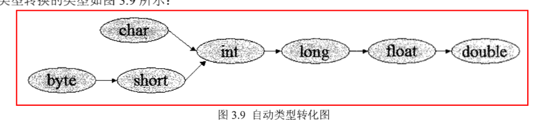

## 基本知识

- 标识符规则
  - 以字母、\_、\$开头
  - 不使用关键字
  - 字母、\_、\$、数字组成
- java 关键字
- 变量类型
  - 基本类型
    - boolean 类型
    - 数值类型
      - 整数类型
        - 以 0 开头 --> 八进制
        - 以 0x 开头 --> 16 进制
        - 字符类型 占两个字节 使用 unicode 编码
      - 浮点类型
        - 非数 NaN ==> 0/0.0 或者 对负数开方
        - POSITIVE_INFINITY 正无穷 ==> 正数/0
        - NEGATIVE_INFINITY 负无穷 ==> 负数/0
        - IEEE754 float ==> 8 位指数，23 位尾数 double==> 11 位指数，52 位尾数
        - 数字带小数点、科学计算形式都以浮点数存储
        - 默认为 double
        - float->0.1f、 double->0.1d
    - ## 类型转化
  - 
    - 隐式转化条件
      - byte 不能自动转换为 char 类型（易引起误解）
      - 小瓶倒入大瓶不会有问题
    - 强制转化
      - boolean 无法进行类型转化
      - 缩小转化 --大瓶的水不能比小瓶多
    - 任何基本类型和字符值进行连接会转化为字符串类型
    - 补码计算
      
    - 表达式类型的自动提升，类型自动提升为最高等级操作数的精度
    - 直接量赋值（可指定直接量：基本类型、字符串类型、null 类型）
      - 类型隐式转化
      - null 可赋值任何引用类型的值

## 运算符

- `--`:
  - 如--放在左边，则先把操作数减 1，然后把操作数放入表达式中运算.
  - 如--放在右边，则操作数放入表达式中运算，然后才把操作数减 1.
  - 无论是前--还是后--，后面引用到值都减 1 后的值,即
  ```java
  int temp=a-- -a;  ==> -1
  ```
- `/`:两个运算数都是整数类型，除数不可以是 0;浮点数运算，除数可为 0.0 或 0
- `%`:两个运算数都是整数类型，除数不可以是 0;浮点数运算，除数可为 0.0 或 0,运算结果不一定是整数
- `>>>` :无符号移位，左边统一以零填充
- `>>`: 有符号移位，左边以原来的符号值填充 1==>11 0==>00
- 扩展后的赋值运算符以有差异的

  ```java
  byte b=5;
  // 此时语句会报错，int赋值给b
  b=b+5;
  // 此时语句正常运行
  b+=5；
  ```

- `==`:

  - 基本类型进行数值比较，对象判断是否为同一个引用
  - 费解的包装类比较

  ```java
  Integer ina=2;
  Integer ina=2;
  // 输出true
  System.out.println("两个2自动装箱后是否相等："+(inta==intb))

  Integer bina=128;
  Integer bina=128;
  // 输出false
  System.out.println("两个2自动装箱后是否相等："+(binta==bintb))

  //原理解析
  static final Integer[] cahce=new Integer[-(-128)+127+1];
  static{
    for(int i=0;i<cache.length;i++){
      cache[i]=new Integer(i-128);
    }
  }
  // -128-127的包装数引用的是同一个对象

  // 通过new调用构造器创建的两个String实例
  String aStr=new String("Hello");
  String bStr=new String("Hello");
  // 输出false
  System.out.println(aStr==bStr);

  String cStr="Hello";
  String dStr="Hello";
  // 输出true
  System.out.println(cStr==dStr);
  ```

- 计算符的结合性和优先级
  - 大部分运算符从左向右结合
  - 单目运算符、赋值运算符、三目运算符是从右向左结合
