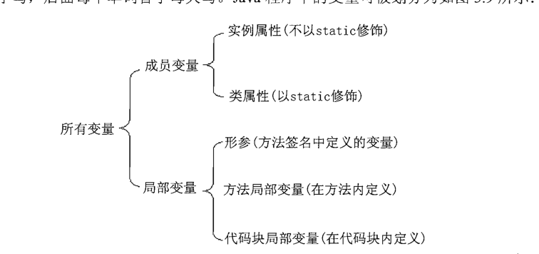
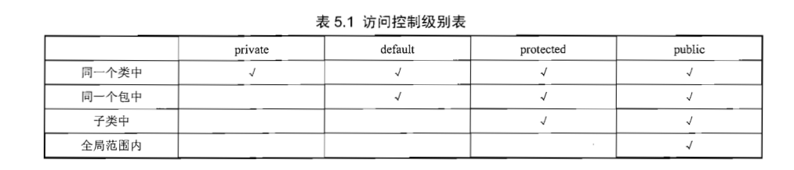

## 面向对象

- 三大特征
  - 封装
  - 继承
  - 多态
- 基本语法
  - 变量说明
    
  - 修饰符
    - public
    - protected
    - private
  - 构造器
    - 无需声明返回类型，若声明返回类型则当成普通方法处理
  - static 表明其是属于类共有的
  - final 与 abstract 不能同时出现
  - this 表示调用当前方法所指向的对象
  - 方法的参数传递机制 -- 值传递（变量复制，引用类型值的引用地址，故函数形参变量与引用指向的同一个对象）
  - 形参长度可变的方法
  ```java
  public class Varargs{
      public static void test(int a,String... books){
      }
  }
  ```
  - 递归方法
  - 方法重载
  - 成员变量和局部变量
  - 变量的内存机制
    - 类成员存于堆内存，所有对象引用同一个块内存
    - 对象成员存于堆内存，归属其对象
    - 局部变量存于栈内存，随方法或代码块的运行结束而结束的，无须系统垃圾回收
    - 变量的使用规则
       - 作用域与其作用相符合

  - 封装
    - 目的 
      - 隐藏类的实现细节
      - 让使用者限制对属性的不合理访问
      - 可进行数据检查
      - 便于修改,增加了一层可修改的代码
    - 权限控制表
      - private和protected 不可修饰类，只修饰类成员
      - default和public 可修饰类和类成员
        
           
