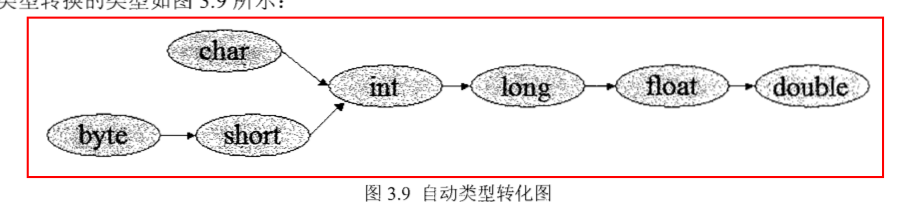
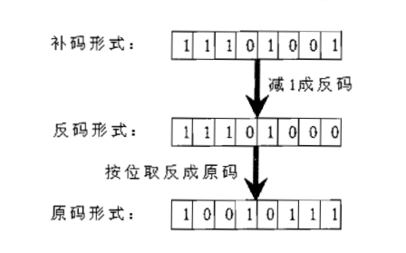

## 基本知识

- 标识符规则
  - 以字母、\_、\$开头
  - 不使用关键字
  - 字母、\_、\$、数字组成
- java 关键字
- 变量类型
  - 基本类型
    - boolean 类型
    - 数值类型
      - 整数类型
        - 以 0 开头 --> 八进制
        - 以 0x 开头 --> 16 进制
        - 字符类型 占两个字节 使用 unicode 编码
      - 浮点类型
        - 非数 NaN ==> 0/0.0 或者 对负数开方
        - POSITIVE_INFINITY 正无穷 ==> 正数/0
        - NEGATIVE_INFINITY 负无穷 ==> 负数/0
        - IEEE754 float ==> 8 位指数，23 位尾数 double==> 11 位指数，52 位尾数
        - 数字带小数点、科学计算形式都以浮点数存储
        - 默认为 double
        - float->0.1f、 double->0.1d
    - ## 类型转化
  - 
    - 隐式转化条件
      - byte 不能自动转换为 char 类型（易引起误解）
      - 小瓶倒入大瓶不会有问题
    - 强制转化
      - boolean 无法进行类型转化
      - 缩小转化 --大瓶的水不能比小瓶多
    - 任何基本类型和字符值进行连接会转化为字符串类型
    - 补码计算
      
    - 表达式类型的自动提升，类型自动提升为最高等级操作数的精度
    - 直接量赋值（可指定直接量：基本类型、字符串类型、null 类型）
      - 类型隐式转化
      - null 可赋值任何引用类型的值

