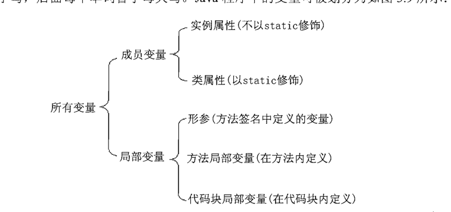
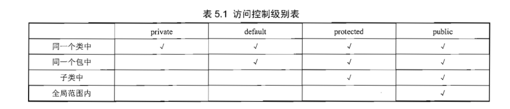

## 面向对象

### 三大特征

- 封装
- 继承
- 多态

### 基本语法

- 变量说明
  
- 修饰符
  - public
  - protected
  - private
- 构造器
  - 无需声明返回类型，若声明返回类型则当成普通方法处理
- static 表明其是属于类共有的
- final 与 abstract 不能同时出现
- this 表示调用当前方法所在类创建的对象（所以 java 的 this 不具有多态）【this 不具有多态】
- 方法的参数传递机制 -- 值传递（变量复制，引用类型值的引用地址，故函数形参变量与引用指向的同一个对象）
- 形参长度可变的方法

```java
public class Varargs{
    public static void test(int a,String... books){
    }
}
```

- 递归方法
- 方法重载
- 成员变量和局部变量
- 变量的内存机制

  - 类成员存于堆内存，所有对象引用同一个块内存
  - 对象成员存于堆内存，归属其对象
  - 局部变量存于栈内存，随方法或代码块的运行结束而结束的，无须系统垃圾回收
  - 变量的使用规则

    - 作用域与其作用相符合

  - 包机制

    - 转载类时，它会依次搜索 CLASSPATH 环境变量所指定的系列路径，查找这些路径下是否包含 lee 路径，并在 lee 路径下查找是否包含 Hello.class 文件
    - 父子包只有名字有关系，用法上使用
    - import 引入某个包的类
    - package 和 import 必须放在所有类定义之前
    - import static 引入类的全部静态属性

  - 深入构造器
    - 声明了构造器，则系统不再提供默认构造器
    - new 先分配内存，通过 this 引用它，等构造器执行完毕，这个对象作为构造器的返回值被返回，从而让外部程序可以访问这个对象
    - 构造器重载
    - 调用父类构造器
      - 默认调用调用父类构造器
      - 若显示调用父类构造器，则显示调用父类构造器初始化(super)
      - 构造器调用本类其他构造器，其他构造器扔需调用父类构造器

### 封装

- 目的
  - 隐藏类的实现细节
  - 让使用者限制对属性的不合理访问
  - 可进行数据检查
  - 便于修改,增加了一层可修改的代码
- 权限控制表
  - private 和 protected 不可修饰类，只修饰类成员
  - default 和 public 可修饰类和类成员
    

### 初始化块

- 实例属性初始化的顺序：声明属性时指定的初始值 -> 执行初始化块-> 执行构造器 -> 类型默认零值（若前面流程变量未被赋值）
- 静态初始化初始化 -声明属性时指定的初始值 -> 执行初始化块 -> 类型默认零值（若前面流程变量未被赋值）

### 对象初始化

- 类是否已经初始化，没有进行类的初始化（类内存 -> 初始化静态初始化块或静态变量 -> 初始化对象 -> 调用构造器(此时只有通过 this 访问到对象)--> 返回对象 ）
- 类成员不能访问实例成员（但构造器比较特殊，单例模式）
- 成员变量的初始化
  - 若有初始化块有对变量进行操作，则先执行其代码块，对变量赋值；
  - 若构造函数有对变量进行操作，则先执行其构造函数赋值;
  - 若两者都没有则赋予默认值
  - 初始化块>构造函数>默认赋值

## final

- 类成员若没有显式初始化则赋予零值
- 局部变量必须进行显式赋值
  - final 定义时可以不指定默认值
  - 初始化后，不能重复赋值
- final 基本类型和引用类型的区别
  - 保证这个引用所引用的地址不会改变
- final 方法不可以被重写
- final 类不可以被继承
- 缓存实例的不可变类，状态不可改变，可以很方便地被多个对象所共享

## abstract

- 抽象类必须用 abstract 来修饰，抽象方法也必须使用 abstract 修饰
- 不可与 private，final，static 一起使用，其不具意义

## interface（更彻底的抽象类）

- 只可定义静态属性，而且成员都是常量
- 方法皆为抽象
- final public
- 接口可继承接口、可多继承
- 类可实现多个接口

## interface 与 abstract 的异同

- 相同
  - 接口和抽象类都不能被实例化，它们都位于继承树的顶端，用于被其他类实现和继承
  - 都包含抽象方法，实现接口或继承抽象类的普通子类都必须实现这些对象方法
- 差异
  - 接口一组规范定义，规范了各个服务以什么形式提供，是多个模块耦合标准
  - 抽象类更像一个半成品，由子类来完善其提供的服务

## 内部类（实例类寄生于父类对象，静态类寄生于父类）

- 内部类类型

  - 静态内部类

    ```java
    class Test{
      static class Inter{

      }
    }
    ```

    - `外部类的静态模块`可直接访问 `静态类的静态属性成员` (但需指定内部类名字，如 IntervalClass.member)
    - `外部类的非静态模块`不可直接访问`静态类的静态属性成员`，可通过类名进行访问
    - `外部类的非静态模块`不可直接访问`静态类的普通属性成员`，可通过类的实例进行访问

  - 内部类的权限控制

    - public 修饰的内部类，可在任何地方被访问
    - protected(默认)修饰的内部类，可包内其他类和外部类的子类访问
    - private 修饰的内部类，只能在外部类的内部访问

  - 非静态内部类

    - 不能有静态方法、静态属性、静态初始化块

  - 局部内部类 - 在方法声明
  - 匿名内部类

- 编译后的类文件为：外部类\$内部类.class
- 通过外部类类名.this 与 this 区分内部类与外部类的属性

## 包装类

- 自动装箱和自动拆箱

```java
    // 自动装箱
    Integer inObj = 5;
    // 自动装箱
    Object boolObj = true;
    // 自动拆箱
    int it = intObj;
```

- 所有包装类
  - 包装类 parseXxx(String s) --> 变成相应基本类型
  - 基本类型通过 String.valueOf --> 变成字符串类型

## 处理对象

- toString 是 Object 类里的一个实例方法 -- "自我描述"
- 输出引用类型将调用 toString 方法
- `==`和 `equals` 的区别
  - equals 有 Object 提供，但 Object.equal 与`==`的作用是类似的，希望采用自定义的相等标准，可重写 equals
  - 未重写的 equals 与`==`是一样的
  - 但在进行对象比较的时候，`==` 操作的对象必现是同一个对象
